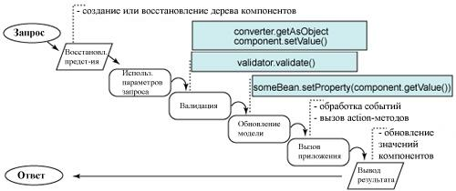

## Лабораторная работа №3

***Вариант 2671*** 


Разработать приложение на базе JavaServer Faces Framework, которое осуществляет проверку попадания точки в заданную область на координатной плоскости.

Приложение должно включать в себя 2 facelets-шаблона - стартовую страницу и основную страницу приложения, а также набор управляемых бинов (managed beans), реализующих логику на стороне сервера.

**Стартовая страница должна содержать следующие элементы:**

*   "Шапку", содержащую ФИО студента, номер группы и номер варианта.
*    Интерактивные часы, показывающие текущие дату и время, обновляющиеся раз в 8 секунд.
*    Ссылку, позволяющую перейти на основную страницу приложения.

**Основная страница приложения должна содержать следующие элементы:**

*   Набор компонентов для задания координат точки и радиуса области в соответствии с вариантом задания. Может потребоваться использование дополнительных библиотек компонентов - [ICEfaces](http://www.icesoft.org/java/projects/ICEfaces/overview.jsf) (префикс "ace") и [PrimeFaces](http://www.primefaces.org/) (префикс "p"). Если компонент допускает ввод заведомо некорректных данных (таких, например, как буквы в координатах точки или отрицательный радиус), то приложение должно осуществлять их валидацию.
*   Динамически обновляемую картинку, изображающую область на координатной плоскости в соответствии с номером варианта и точки, координаты которых были заданы пользователем. Клик по картинке должен инициировать сценарий, осуществляющий определение координат новой точки и отправку их на сервер для проверки её попадания в область. Цвет точек должен зависить от факта попадания / непопадания в область. Смена радиуса также должна инициировать перерисовку картинки.
*   Таблицу со списком результатов предыдущих проверок.
*   Ссылку, позволяющую вернуться на стартовую страницу.

**Дополнительные требования к приложению:**

*   Все результаты проверки должны сохраняться в базе данных под управлением СУБД Oracle.
*   Для доступа к БД необходимо использовать ORM EclipseLink.
*   Для управления списком результатов должен использоваться Session-scoped Managed Bean.
*   Конфигурация управляемых бинов должна быть задана с помощью аннотаций.
*   Правила навигации между страницами приложения должны быть заданы в отдельном конфигурационном файле.

**Вопросы к защите лабораторной работы:**

*  Технология JavaServer Faces. Особенности, отличия от сервлетов и JSP, преимущества и недостатки. Структура JSF-приложения.
*  Использование JSP-страниц и Facelets-шаблонов в JSF-приложениях.
*  JSF-компоненты - особенности реализации, иерархия классов. Дополнительные библиотеки компонентов. Модель обработки событий в JSF-приложениях.
*  Конвертеры и валидаторы данных.
*  Представление страницы JSF на стороне сервера. Класс UIViewRoot.
*  Управляемые бины - назначение, способы конфигурации. Контекст управляемых бинов.
*  Конфигурация JSF-приложений. Файл faces-config.xml. Класс FacesServlet.
*  Навигация в JSF-приложениях.
*  Доступ к БД из Java-приложений. Протокол JDBC, формирование запросов, работа с драйверами СУБД.
*  Концепция ORM. Библиотеки ORM в приложениях на Java. Основные API. Интеграция ORM-провайдеров с драйверами JDBC.
*  Библиотеки ORM Hibernate и EclipseLink. Особенности, API, сходства и отличия.
*  Технология JPA. Особенности, API, интеграция с ORM-провайдерами.

## Ответы

*   Технология JavaServer Faces. Особенности, отличия от сервлетов и JSP, преимущества и недостатки. Структура JSF-приложения.
    *   [Технология JavaServer Faces](#технология-javaserver-faces)
    *   [Особенности, отличия от сервлетов и JSP, преимущества и недостатки](#особенности-отличия-от-сервлетов-и-jsp-преимущества-и-недостатки)
    *   [Структура JSF-приложения](#структура-jsf-приложения)
*   Использование JSP-страниц и Facelets-шаблонов в JSF-приложениях.
    *   [Использование JSP-страниц и Facelets-шаблонов в JSF-приложениях](#использование-jsp-страниц-и-facelets-шаблонов-в-jsf-приложениях)
*   JSF-компоненты - особенности реализации, иерархия классов. Дополнительные библиотеки компонентов. Модель обработки событий в JSF-приложениях.
    *   [JSF-компоненты - особенности реализации, иерархия классов](#jsf-компоненты---особенности-реализации-иерархия-классов)
    *   [Дополнительные библиотеки компонентов](#дополнительные-библиотеки-компонентов)  
    *   [Модель обработки событий в JSF-приложениях](#модель-обработки-событий-в-jsf-приложениях)
*   Конвертеры и валидаторы данных.
    *   [Конвертеры и валидаторы данных](#конвертеры-и-валидаторы-данных)
*   Представление страницы JSF на стороне сервера. Класс UIViewRoot.
    *   [Представление страницы JSF на стороне сервера](#представление-страницы-jsf-на-стороне-сервера)
    *   [Класс UIViewRoot](#класс-uiviewroot)
*   Управляемые бины - назначение, способы конфигурации. Контекст управляемых бинов.
    *   [Управляемые бины - назначение, способы конфигурации](#управляемые-бины---назначение-способы-конфигурации)
    *   [Контекст управляемых бинов](#контекст-управляемых-бинов)
    
### Технология JavaServer Faces

<b>Java Server Faces</b> (JSF) — это фреймворк для веб-приложений, написанный на Java. Он служит для того, 
чтобы облегчать разработку пользовательских интерфейсов для Java EE приложений. В отличие от прочих MVC фреймворков, 
которые управляются запросами, подход JSF основывается на использовании компонентов. Состояние компонентов 
пользовательского интерфейса сохраняется, когда пользователь запрашивает новую страницу и затем восстанавливается, 
если запрос повторяется. Для отображения данных обычно используется JSP, Facelets, но JSF можно приспособить и 
под другие технологии, например XUL.

Технология <b>JavaServer Faces</b> включает:

-   Набор API для представления компонент пользовательского интерфейса (UI) и управления их состоянием, обработкой 
событий и валидацией вводимой информации, определения навигации, а также поддержку интернационализации (i18n) и 
доступности (accessibility).
-   Специальная библиотека JSP тегов для выражения интерфейса JSF на JSP странице.
-   Призванная быть гибкой, технология JavaServer Faces усиливает существующие, стандартные концепции пользовательского
интерфейса (UI) и концепции Web-уровня без привязки разработчика к конкретному языку разметки, протоколу или 
клиентскому устройству.

### Особенности, отличия от сервлетов и JSP, преимущества и недостатки

Сервлет - это программный интерфейс приложения Java (API), работающий на серверной машине, который перехватывает
запросы клиента и генерирует/отправляет ответ. Хорошо известным примером является `HttpServlet` , который предоставляет
методы для подключения к HTTP запросам с использованием популярных методов HTTP, таких, как `GET` и `POST`.
Вы можете настроить `HttpServlet` для прослушивания определенного шаблона HTTP URL, который настраивается в `web.xml`,
или более недавно с Java EE 6, с `@WebServlet` аннотацией.
 
При первом запросе сервлета или при запуске веб-приложения контейнер сервлета создает его экземпляр и сохраняет его
в памяти в течение всего срока службы веб-приложения. Один и тот же экземпляр будет повторно использоваться для каждого
входящего запроса, чей URL соответствует шаблону URL сервлета. Вы можете получить доступ к данным запроса
по `HttpServletRequest` и обработать ответ по `HttpServletResponse`. Оба объекта доступны в качестве аргументов метода
внутри любого из переопределенных методов `HttpServlet`, таких как `doGet()` и `doPost()`.

JSP - это технология просмотра Java, работающая на серверной машине, которая позволяет вам писать текст шаблона на
клиентских языках (например, HTML, CSS, JavaScript и т. д.). JSP поддерживает taglibs, которые поддерживаются
фрагментами кода Java, которые позволяют управлять потоком страниц или выводом динамически. Хорошо известный
`taglib` - это JSTL. JSP также поддерживает язык выражений, который может использоваться для доступа к внутренним
данным (через атрибуты, доступные в области страницы, запроса, сеанса и приложения), в основном в сочетании с тегами.
 
Когда JSP запрашивается в первый раз или когда веб-приложение запускается, контейнер сервлета компилирует его в класс,
расширяющий `HttpServlet`, и использует его в течение всего срока службы веб-приложения. Созданный исходный код можно
найти в рабочем каталоге сервера. Например, в Tomcat это каталог `/work`. По запросу JSP контейнер сервлета выполнит
скомпилированный класс JSP и отправит сгенерированный вывод (обычно только HTML/CSS/JS) через веб-сервер по сети на
клиентскую сторону, которая, в свою очередь, отобразит его в веб-браузере.

JSF - это основанный на компонентах фреймворк MVC, который построен поверх Servlet API и предоставляет компоненты
через `taglibs`, которые могут быть использованы в JSP или любой другой технологии представления на основе Java, такой,
как Facelets. Facelets гораздо больше подходит для JSF, чем JSP. В частности, он предоставляет большие возможности
для создания шаблонов, таких как составные компоненты, в то время как JSP в основном предлагает только `<jsp:include>`
для создания шаблонов в JSF, так что вы вынуждены создавать пользовательские компоненты с необработанным кодом Java
(что немного непрозрачно и много утомительной работы), когда вы хотите заменить повторяющуюся группу компонентов одним
компонентом. Начиная с JSF 2.0, JSP был объявлен устаревшей технологией просмотра в пользу Facelets.

<b><i>Примечание</i></b>: JSP сам по себе является `NOT` устаревшим, только комбинация JSF с JSP является устаревшей.

<b><i>Примечание</i></b>: JSP имеет большие возможности шаблонизации с помощью Taglibs, особенно вариант (файл тегов).
JSP шаблонность в сочетании с JSF-вот чего не хватает.

Будучи фреймворком MVC ( Model-View-Controller), JSF предоставляет FacesServlet в качестве единственного контроллера
запроса-ответа. Он берет всю стандартную и утомительную работу HTTP запроса/ответа из ваших рук, такую как сбор
пользовательского ввода, проверка/преобразование их, помещение их в объекты модели, вызов действий и визуализация
ответа. Таким образом, вы получите в основном страницу JSP или Facelets (XHTML) для представления и класс JavaBean в
качестве модели. Компоненты JSF используются для привязки представления к модели (например, ваш веб-элемент управления
ASP.NET), а `FacesServlet` использует дерево компонентов JSF для выполнения всей работы.

<b><i>С точки зрения браузера/клиента</i></b>:    

*   JSP и JSF оба выглядят одинаково, в соответствии с требованиями приложения идет, JSP больше подходит для приложений,
основанных на запросе - ответе.
*   JSF предназначен для более богатых веб-приложений на основе событий. Я вижу событие гораздо более зернистым,
чем request/response.

<b><i>С Точки Зрения Сервера</i></b>:

*   JSP страница преобразуется в сервлет, и ее поведение минимально.
*   Страница JSF преобразуется в дерево компонентов (по специализации `FacesServlet`) и следует за жизненным циклом
компонента, определенным спецификацией.

<b>Преимущества и недостатки:</b>

*   Четкое разделение бизнес-логики и интерфейса (фреймворк реализует шаблон MVC)    
*   Управление сохраняемостью на уровне компонент
*   Простая работа с событиями на стороне сервера   
*   Расширяемость (можно использовать дополнительные наборы компонентов)
*   Доступность нескольких реализаций от различных компаний-разработчиков       
*   Широкая поддержка со стороны интегрированных средств разработки (IDE)

*   Высокоуровневый фреймворк - сложно реализовать не предусмотренную авторами функциональность
*   Сложности с обработкой GET-запросов (устранены в JSF-2.0)
*   Сложность разработки собственных компонентов

### Структура JSF-приложения

*   JSP-страницы с компонентами GUI
*   Библиотека тегов
*   Управляемые бины
*   Дополнительные объекты(компоненты, конвертеры, вылидаторы)
*   Дополнительные теги
*   Конфигурация – `faces-config.xml`
*   Дискриптор развертывания – `web.xml`

### Использование JSP-страниц и Facelets-шаблонов в JSF-приложениях

Интерфейс <b>JSF-приложения</b> состоит из страниц JSP (Java Server Pages), которые содержат компоненты, обеспечивающие
функциональность интерфейса. При этом библиотеки тегов JSP используются на JSP-страницах для отрисовки компонентов
интерфейса, регистрации обработчиков событий, связывания компонентов с валидаторами и конвертаторами данных и много
другого.

При этом нельзя сказать, что JSF неразрывно связана с JSP, т.к. теги, используемые на JSP-страницах только отрисовывают
компоненты, обращаясь к ним по имени. Жизненный цикл компонентов JSF не ограничивается JSP-страницей.

Например, при изменении неких атрибутов на JSP-странице, а затем при обновлении ее, можно заметить что ничего не
изменилось (т.е. теги на странице обращаются к текущему состоянию компонента). Состояние компонент может быть
модифицировано контроллером.

Технология <b>Facelets</b> была изначально разработана как альтернатива обработчику представлений на основе JSP,
применявшемуся в ранних версиях JSF. В версии JSF 2.0 Facelets заменила JSP в качестве применявшейся по умолчанию.

Для размещения компонентов на странице <b>Facelets</b> поддерживают большое число разнообразных библиотек тегов.
Для этого <b>Facelets</b> использует XML-декларации пространства имён (namespace). Facelets также поддерживает теги
составных компонентов, для которых можно объявить собственные префиксы. В таблице представлен список поддерживаемых
<b>Facelets</b> тегов, включенных в фреймворк.

| Библиотека                   | URL                                    | Префикс        | Пример                                                  | Содержимое                                         |
| :---                         | :---                                   | :---           | :---                                                    | :---                                               |
| Теги Facelets                | http://java.sun.com/jsf/facelets       | `ui:`          | `ui:component`<br>`ui:insert`                           | Теги для шаблонов страниц                          |
| Библиотека HTML тегов        | http://java.sun.com/jsf/html           | `h:`           | `h:head`<br>`h:body`<br>`h:outputText`<br>`h:inputText` | Теги для всех компонентов UIComponents             |
| Библиотека ядра JSF          | http://java.sun.com/jsf/core           | `f:`           | `f:actionListener`<br>`f:attribute`                     | Базовые компоненты JSF, не связанные с рендерингом |
| Теги ядра библиотеки JSTL    | http://java.sun.com/jsp/jstl/core      | `c:`           | `c:forEach`<br>`c:catch`                                | Ядро библиотеки JSTL                               |
| Теги функций библиотеки JSTL | http://java.sun.com/jsp/jstl/functions | `fn:`          | `fn:toUpperCase`<br>`fn:toLowerCase`                    | Функции библиотеки JSTL                            |

Теги Facelets могут быть сгруппированы по нескольким категориям:

*   Включение содержимого из других страниц XHTML — `ui:include`;
*   Формирование страниц из шаблонов — `ui:composition`, `ui:decorate`, `ui:insert`, `ui:define`, `ui:param`;
*   Создание пользовательских компонентов без написания кода Java — `ui:component`, `ui:fragment`;
*   Различные утилиты — `ui:debug`, `ui:remove`, `ui:repeat`.

В таблице приведены краткие сведения о тегах Facelets:

| Наименование тега | Описание                                                                                                                                                                                                                                                                                                                                                                                                   |
| :---              | :---                                                                                                                                                                                                                                                                                                                                                                                                       |
| `ui:include`      | Включает содержимое из другого файла XML.                                                                                                                                                                                                                                                                                                                                                                  |
| `ui:composition`  | Будучи использованным без атрибута `template`, этот тег определяет последовательность элементов, которая может быть вставлена в другом месте. Композиция может иметь переменные части указанные с помощью дочерних тегов `ui:insert`.<br>При использовании с атрибутом `template`, загружается шаблон. Дочерние теги этого тега определяют переменные части шаблона. Содержимое шаблона заменяет этот тег. |
| `ui:decorate`     | Будучи использованным без атрибута `template` этот тег определяет страницу, в которую могут быть вставлены части. Переменные части задаются с помощью дочерних тегов `ui:insert`.<br>При использовании с атрибутом `template`, загружается шаблон. Дочерние теги этого тега определяют переменные части шаблона.                                                                                           |
| `ui:define`       | Определяет содержимое, которое вставляется в шаблон с помощью соответствующих тегов `ui:insert`.                                                                                                                                                                                                                                                                                                           |
| `ui:insert`       | Вставляет содержимое в шаблон. Это содержимое определяется в теге, который загружает шаблон.                                                                                                                                                                                                                                                                                                               |
| `ui:param`        | Задает параметр, передаваемый во включенный файл или шаблон.                                                                                                                                                                                                                                                                                                                                               |
| `ui:component`    | Этот тег идентичен `ui:composition`, за исключением того, что создает компонент добавляемый к дереву компонентов.                                                                                                                                                                                                                                                                                          |
| `ui:fragment`     | Этот тег идентичен `ui:decorate`, за исключением того, что создает компонент добавляемый к дереву компонентов.                                                                                                                                                                                                                                                                                             |
| `ui:debug`        | Этот тег позволяет пользователю с помощью определенной комбинации клавиш вывести на экран окно отладки, в котором показаны иерархия компонентов для текущей страницы и переменные с областью действия приложения.                                                                                                                                                                                          |
| `ui:remove`       | Реализация JSF удаляет все, что находится в этом теге.                                                                                                                                                                                                                                                                                                                                                     |
| `ui:repeat`       | Выполняет итерации по списку, массиву, результирующему набору или отдельному объекту.                                                                                                                                                                                                                                                                                                                      |

### JSF-компоненты - особенности реализации, иерархия классов

<b>Особенности реализации:</b>

*   Интерфейс строится из компонентов
*   Компоненты расположены на страницах JSP
*   Компоненты реализуют интерфейс `javax.faces.component.UIComponent`
*   Можно создавать собственные компоненты
*   Компоненты на странице объединены в древовидную структуру — представление
*   Корневым элементов представления является экземпляр класса `javax.faces.component.UIViewRoot`

<b>Иерархия классов:</b>

*   `javax.faces.component.UIComponent {abstract}`
    *   `javax.faces.component.UIComponentBase {abstract}`
        *   `javax.faces.component.UIColumn`
        *   `javax.faces.component.UICommand`
        *   `javax.faces.component.UIData`
        *   `javax.faces.component.UIForm`
        *   `javax.faces.component.UIGraphic`
        *   `javax.faces.component.UIImportConstants`
        *   `javax.faces.component.UIMessage`
        *   `javax.faces.component.UIMessages`
        *   `javax.faces.component.UINamingContainer`
        *   `javax.faces.component.UIOutput`
            *   `javax.faces.component.UIInput`
                *   `javax.faces.compoent.UISelectBoolean`
                *   `javax.faces.compoent.UISelectMany`
                *   `javax.faces.compoent.UISelectOne`
                *   `javax.faces.compoent.UIViewParameter`
            *   `javac.faces.component.UIOutcomeTarget`
        *   `javax.faces.component.UIPanel`
        *   `javax.faces.component.UIParameter`
        *   `javax.faces.component.UISelectItem`
        *   `javax.faces.component.UISelectItems`
        *   `javax.faces.component.UIViewAction`
        *   `javax.faces.component.UIViewRoot`
        *   `javax.faces.component.UIWebSocket`
    *   `javax.faces.component.UIViewParameter.Reference`
    
### Дополнительные библиотеки компонентов
    
JSF - это веб-среда MVC, управляемая запросами, для создания пользовательских интерфейсов с использованием компонентов.

И PrimeFaces/RichFaces/IceFaces являются компонентами/JSF-библиотеками, которые вы можете использовать поверх JSF

*   <b>RichFaces</b>: это библиотека компонентов с поддержкой Ajax с открытым исходным кодом для JavaServer Faces
*   <b>ICEfaces</b>, open-source, Java JSF расширение и богатые компоненты, Ajax без JavaScript-а
*   <b>PrimeFaces</b> Структура Ajax с компонентами JSF

### Модель обработки событий в JSF-приложениях

<b>Жизненный цикл обработки запроса в приложениях JSF состоит из следующих фаз:</b>

*   Восстановление представления
*   Использование параметров запроса `=>` обработка событий
*   Проверка данных `=>` обработка событий
*   Обновление данных модели `=>` обработка событий
*   Вызов приложения `=>` обработка событий

<b>Вывод результата:</b>

1.  <i>Фаза формирования представления.</i> JSF Runtime формирует представление по запросу(request) пользователя:
    создаются объекты компонентов, назначаются слушатели событий, конвертеры и валидаторы, все элементы представления
    помещаются в `FacesContext`.
    
2.  <i>Фаза получения значений компонентов.</i> Вызывается конвертер из стокового типа данных в требуемый тип.
    Если конвертация успешна, то значение сохраняется в локальной переменной компоненте. Если неуспешно – создается
    сообщение об ошибке и помещается в `FacesContext`.
    
3.  <i>Фаза валидации значений компонентов.</i> Вызываются валидаторы, зарегистрированные для компонентов представления.
    Если значение компонента не проходит валидацию, создается сообщение об ошибке и сохраняется в `FacesContext`.
    
4.  <i>Фаза обновления значений компонентов.</i> Если данные валидны, то значение компонента обновляется. Новое значение
    присваивается полю объекта компонента.

5.  <i>Фаза вызова приложения.</i> Управление передается слушателям событий. Формируются новые значение компонентов.

6.  <i>Фаза формирования ответа сервера.</i> Обновляется представление в соответствии с результатом обработки запроса.
    Если это первый запрос к странице, то компоненты помещаются в иерархию представления. Формируется ответ сервера на
    запрос(response). На стороне клиента происходит обновление страницы.
    
    

### Конвертеры и валидаторы данных

<b>Конвертеры данных в JSF</b>

<b>Конвертация</b> – это процесс преобразования данных к нужным типам. В процессе конвертации строковые поля форм
преобразуются в даты (класс `Date`), примитивные типы `float`, в объекты типа `Float` и т.д. JSF позволяет использовать
как встроенные, так и специально созданные для данного приложения конвертеры. Вначале мы расскажем об использовании
стандартных конвертеров JSF, а затем подробно рассмотрим создание специализированных конвертеров.

<b>Стандартные конвертеры JSF</b>

В стандартную поставку JSF входит множество стандартных конвертеров данных, благодаря чему большая часть конвертации
происходит автоматически. В таблице 1 приведены идентификаторы стандартных конвертеров и реализующие их классы. Они
используются в JSF для преобразования строк к простым типам.

<b><i>Стандартные конвертеры</i></b>


| Конвертер                | Реализующий класс |
| :---                     | :--- |
| `javax.faces.BigDecimal` | `javax.faces.convert.BigDecimalConverter` |
| `javax.faces.BigInteger` | `javax.faces.convert.BigIntegerConverter`| 
| `javax.faces.Boolean`    | `javax.faces.convert.BooleanConverter` |
| `javax.faces.Byte`       | `javax.faces.convert.ByteConverter` |
| `javax.faces.Character`  | `javax.faces.convert.CharacterConverter`| 
| `javax.faces.DateTime`   | `javax.faces.convert.DateTimeConverter` |
| `javax.faces.Double`     | `javax.faces.convert.DoubleConverter` |
| `javax.faces.Float`      | `javax.faces.convert.FloatConverter` |

<b><i>Назначение конвертеров:</i></b>

*   Автоматически (на основе типа данных): 
    ```xhtml
    <h:inputText value="#{user.age}"/>
    ```
*   С помощью атрибута converter:
    ```xhtml
    <h:inputText converter="#{javax.faces.DataTime}"/>
    ```
*   С помощью вложенного тега:
    ```xhtml
    <h:outputText value="#{user.birthDay}">
        <f:converter converterId="#{javax.faces.DateTime}"/>
    </h:outputText>
    ```
<i>Для создания специализированного конвертера необходимо следующее:</i>

Создать класс, реализующий интерфейс `Converter` (полное имя `javax.faxes.convert.Converter`). Реализовать метод
`getAsObject()`, который будет вызываться для преобразования строкового значения поля в объект (например,
типа `PhoneNumber`). Реализовать метод `getAsString`, который будет вызываться для получения строкового представления
объекта (например, типа `PhoneNumber`). Зарегистрировать конвертер в контексте Faces. После того, как конвертеры
созданы, необходимо указать JSF, что их необходимо использовать каждый раз, когда значения связываются со свойствами
типа Group или Tag. Для этого необходимо зарегистрировать конвертеры в файле `faces-config.xml`, используя элемент
`<converter>`.

<i>Регистрация конвертеров в файле `faces-config.xml`</i>

```xml
<converter>
    <converter-for-class>
        ru.itmo.web.model.Group
    </converter-for-class>
    <converter-class>
        ru.itmo.web.converter.GroupConverter
    </converter-class>
</converter>
```

<b>Валидаторы в JSF</b>

Главной целью конвертации и валидации является подготовка данных для обновления объектов модели. Таким образом,
к моменту вызова методов, реализующих логику приложения, можно сделать определенные выводы о состоянии модели.
Конвертация и валидация позволяют сконцентрироваться на бизнес-логике приложения, а не на утомительных проверках
ввода, таких как проверка на null, на длину, на границы массивов и т.д.

<b><i>В JSF существует четыре варианта того, как может происходить валидация:</i></b>

*   С помощью встроенных компонентов
*   На уровне приложения
*   С помощью проверочных методов серверных объектов (`inline-валидация`)
*   С помощью специализированных компонентов, реализующих интерфейс `Validator`

<i>Стандартная валидация</i>

`DoubleRangeValidator`: Проверяет, что значение компонента укладывается в интервал, определяемый нижней границей,
                        верхней границей или и тем, и другим. Значение должно быть числом.
                        
`LongRangeValidator`: Проверяет, что значение укладывается в интервал, определяемый нижней границей, верхней границей
                        или и тем, и другим. Значение должно быть числом, преобразуемым к типу `long`.

`LengthValidator`: Проверяет, что длина значения укладывается в интервал, определяемый нижней границей, верхней
                        границей или и тем, и другим. Значение должно быть типа `String`.
                        
<b><i>Способы валидации данных:</i></b>

*   С помощью параметров компонента:
    ```xhtml
    <h:inputText id="zip" size="10" value="#{customerBean.zip}" required="true"/>
    <h:message for="zip"/>
    ```
*   С помощью вложенного тега:
    ```xhtml
    <h:inputText id="quantity" size="4" value="#{item.quantity}">
        <f:validateLongRange minimum="1"/>
    </h:inputText>
    <h:message for="quantity"/>
    ```
*   С помощью логики на уровне управляемого бина.

<i>Валидация уровня приложения</i>

Под валидацией уровня приложения понимается непосредственно бизнес-логика. В JSF она отделена от первичной валидации
форм и их полей. Как правило, валидация уровня приложения заключается в добавлении в методы управляемых bean-объектов
кода, который использует модель приложения для проверки уже помещенных в нее данных. Допустим, пользователь нажал на
кнопку, связанную с action-методом, исполняемом на этапе вызова приложения. Перед тем, как с данными будут произведены
какие-либо действия (что, как правило, происходит в фазе обновления модели), можно проверить, являются ли введенные
данные корректными с точки зрения бизнес-правил приложения.

<i>Автономные специализированные валидаторы</i>

JSF позволяет создавать подключаемые валидирующие компоненты, которые можно использовать в различных Web-приложениях.

Для создания валидатора необходимо сделать следующее:

*   Класс, реализующий интерфейс `Validator` (`javax.faces.validator.Validator`)
*   Реализовать метод `validate()`
*   Зарегистрировать валидатор в файле `faces-config.xml`
*   Использовать тег `<f:validator/>` на страницах JSP.

<i>Регистрация валидатора в файле `faces-config.xml`:</i>

```xhtml
<validator>
    <validator-id>ru.ifmo.web.zipCode</validator-id>
    <validator-class>ru.ifmo.web.ZipCodeValidator</validator-class>
</validator>
```

### Представление страницы JSF на стороне сервера

`UI Component`. Объект с состоянием, методами, событиями, который содержится на сервере и отвечает за взаимодействие
с пользователем. По сути, это визуальный компонент. Самое главное, что каждый UI компонент содержит метод для
прорисовки самого себя — метод `render`. `Render` прорисовывает себя согласно правилам. Какие правила могут быть?
Правила задаются следующим классом — `Renderer`

`Renderer` - Отвечает за отображение компонента и преобразование ввода пользователя. То есть когда срабатывает
предыдущий метод render, он обращается к Renderer и говорит: «рисуй, вот тебе мои данные, рисуй».

`Convertor` - Преобразует свойства компонента в/из строки для отображения. Отвечает за преобразование поступивших
данных в данные, которые понимает UI компонент. Также это правило работает и в обратную сторону.

`Backing bean` - Специальный `JavaBean` (java класс), который собирает значения из компонент, реагирует на события,
взаимодействует с бизнес-логикой. Связан с каждым компонентом. Их может быть несколько, он является необязательным
для UI компонента, он просто его использует.

`Events` and `Listeners` - компоненты генерируют события, слушатели реагируют на них.

`Messages` - сообщения, генерируемые любым объектом JSF и отображаемые пользователям. Это объект, который содержит
в себе сообщение, которое будет выведено пользователю, либо не будет выведено.

`Navigation` - Схема навигации между страницами. Это правила навигации, которые определяют, как мы будем переходить
между различными страницами. Правила задаются в виде `xml` документа.

### Класс UIViewRoot

JSF представляет собой набор пользовательских компонентов в виде дерева, которые формируют представление. Представление
представлено объектом `UIViewRoot`, который связан с активным `FacesContext`. Состояние представления может сохраняться
как на клиентской стороне (в `hidden` полях), так и на серверной (по умолчанию). Во время выполнения, JSF реализация
создаёт представление при первом обращении (запросе), либо восстанавливает уже созданное. Когда клиент отправляет
форму (`postback`), JSF конвертирует отправленные данные, проверяет их, сохраняет в `managed bean`, находит
представление для навигации, восстанавливает значения компонента из `managed bean`, генерирует ответ по представлению.
Все эти действия JSF описывает с помощью 6 упорядоченных процессов, которыми можно управлять (вызывая например метод
`renderResponse()` у активного `FacesContext`, либо используя свойство компонентов `immediate="true"`). Каждый раз, как
пользователь отправляет запрос на сервер, один либо более процессов принимают участие в его обработке, после чего
формируется и отправляется ответ.

### Управляемые бины - назначение, способы конфигурации

<b>Управляемые бины</b> – классы, содержащие параметры и методы для обработки данных с компонентов. Имеют набор методов
`get` и `set` для получения/установки свойств. Используются для обработки UI и валидации данных. ЖЦ управляет 
JSF Runtime Environment. Доступ из JSP-страниц осуществляется с помощью языка выражений (EL). Конфигурация задается
либо в `faces-config.xml`, либо с помощью аннотаций.

<b>Managed bean</b> - это обычный Java бин, который зарегистрирован в JSF и управляется JSF платформой. В JSF managed
bean используются в качестве модели для компонентов и имеют свою область жизни (scope), которую можно задать, как
при помощи аннотации, так и в конфигурационном файле `faces-config.xml`.

### Контекст управляемых бинов

<i>Рассмотрим варианты областей жизни, которые задаются в managed bean при помощи аннотаций:</i>

| Область видимости    | Описание |
| :---                 | :--- |
| `@RequestScoped`     | Бин живёт до тех пор, пока существует HTTP запрос-ответ. Он создаётся во время выполнения HTTP – запроса и уничтожается, когда HTTP – ответ, ассоциированный с данным запросом завершается. |
| `@NoneScoped`        | Бин живёт так долго, как EL оценка. Создаётся в момент EL оценки и уничтожается сразу после неё. |
| `@ViewScoped`        | Бин живёт до тех пор, пока пользователь взаимодействует с JSF представлением в браузере или окне. Создаётся в момент HTTP – запроса и уничтожается после того, как пользователь переходит к другому JSF представлению (например, на другую страницу). |
| `@SessionScoped`     | Бин живет до тех пор, пока существует HTTP сессия. Создаётся в момент первого HTTP – запроса, который вводит данный бин в сессию и уничтожается в момент, когда сессия становится не валидной. |
| `@ApplicationScoped` | Бин живет, пока живёт приложение. Создаётся в момент первого HTTP – запроса, который вводит данный бин в приложение (или когда приложение запускается, в случае `“eager = true“`) и уничтожается в момент прекращения завершения работы приложения. |
| `@CustomScoped`      | Бин живёт, пока входит в указанную Map. |

