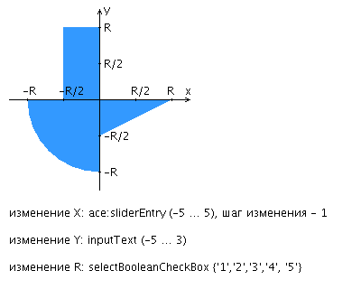

## Лабораторная работа №3

***Вариант 2671*** 

Разработать приложение на базе JavaServer Faces Framework, которое осуществляет проверку попадания точки в заданную область на координатной плоскости.

Приложение должно включать в себя 2 facelets-шаблона - стартовую страницу и основную страницу приложения, а также набор управляемых бинов (managed beans), реализующих логику на стороне сервера.

**Стартовая страница должна содержать следующие элементы:**

*   "Шапку", содержащую ФИО студента, номер группы и номер варианта.
*    Интерактивные часы, показывающие текущие дату и время, обновляющиеся раз в 8 секунд.
*    Ссылку, позволяющую перейти на основную страницу приложения.

**Основная страница приложения должна содержать следующие элементы:**

*   Набор компонентов для задания координат точки и радиуса области в соответствии с вариантом задания. Может потребоваться использование дополнительных библиотек компонентов - [ICEfaces](http://www.icesoft.org/java/projects/ICEfaces/overview.jsf) (префикс "ace") и [PrimeFaces](http://www.primefaces.org/) (префикс "p"). Если компонент допускает ввод заведомо некорректных данных (таких, например, как буквы в координатах точки или отрицательный радиус), то приложение должно осуществлять их валидацию.
*   Динамически обновляемую картинку, изображающую область на координатной плоскости в соответствии с номером варианта и точки, координаты которых были заданы пользователем. Клик по картинке должен инициировать сценарий, осуществляющий определение координат новой точки и отправку их на сервер для проверки её попадания в область. Цвет точек должен зависить от факта попадания / непопадания в область. Смена радиуса также должна инициировать перерисовку картинки.
*   Таблицу со списком результатов предыдущих проверок.
*   Ссылку, позволяющую вернуться на стартовую страницу.

**Дополнительные требования к приложению:**

*   Все результаты проверки должны сохраняться в базе данных под управлением СУБД Oracle.
*   Для доступа к БД необходимо использовать ORM EclipseLink.
*   Для управления списком результатов должен использоваться Session-scoped Managed Bean.
*   Конфигурация управляемых бинов должна быть задана с помощью аннотаций.
*   Правила навигации между страницами приложения должны быть заданы в отдельном конфигурационном файле.

**Вопросы к защите лабораторной работы:**

*  Технология JavaServer Faces. Особенности, отличия от сервлетов и JSP, преимущества и недостатки. Структура JSF-приложения.
*  Использование JSP-страниц и Facelets-шаблонов в JSF-приложениях.
*  JSF-компоненты - особенности реализации, иерархия классов. Дополнительные библиотеки компонентов. Модель обработки событий в JSF-приложениях.
*  Конвертеры и валидаторы данных.
*  Представление страницы JSF на стороне сервера. Класс UIViewRoot.
*  Управляемые бины - назначение, способы конфигурации. Контекст управляемых бинов.
*  Конфигурация JSF-приложений. Файл faces-config.xml. Класс FacesServlet.
*  Навигация в JSF-приложениях.
*  Доступ к БД из Java-приложений. Протокол JDBC, формирование запросов, работа с драйверами СУБД.
*  Концепция ORM. Библиотеки ORM в приложениях на Java. Основные API. Интеграция ORM-провайдеров с драйверами JDBC.
*  Библиотеки ORM Hibernate и EclipseLink. Особенности, API, сходства и отличия.
*  Технология JPA. Особенности, API, интеграция с ORM-провайдерами.

---

### Ответы

*   Технология JavaServer Faces. Особенности, отличия от сервлетов и JSP, преимущества и недостатки. Структура JSF-приложения.
    *   [Технология JavaServer Faces](#технология-javaserver-faces)
    *   [Особенности, отличия от сервлетов и JSP, преимущества и недостатки](#особенности-отличия-от-сервлетов-и-jsp-преимущества-и-недостатки)
    *   [Структура JSF-приложения](#структура-jsf-приложения)
    
#### Технология JavaServer Faces

>   <b>Java Server Faces</b> (JSF) — это фреймворк для веб-приложений, написанный на Java. Он служит для того, чтобы облегчать разработку пользовательских интерфейсов для Java EE приложений. В отличие от прочих MVC фреймворков, которые управляются запросами, подход JSF основывается на использовании компонентов. Состояние компонентов пользовательского интерфейса сохраняется, когда пользователь запрашивает новую страницу и затем восстанавливается, если запрос повторяется. Для отображения данных обычно используется JSP, Facelets, но JSF можно приспособить и под другие технологии, например XUL.
>
>   Технология <b>JavaServer Faces</b> включает:
>
>   -   Набор API для представления компонент пользовательского интерфейса (UI) и управления их состоянием, обработкой событий и валидацией вводимой информации, определения навигации, а также поддержку интернационализации (i18n) и доступности (accessibility).
>   -   Специальная библиотека JSP тегов для выражения интерфейса JSF на JSP странице.
>   -   Призванная быть гибкой, технология JavaServer Faces усиливает существующие, стандартные концепции пользовательского интерфейса (UI) и концепции Web-уровня без привязки разработчика к конкретному языку разметки, протоколу или клиентскому устройству.

#### Особенности, отличия от сервлетов и JSP, преимущества и недостатки

>   Сервлет - это программный интерфейс приложения Java (API), работающий на серверной машине, который перехватывает запросы клиента и генерирует/отправляет ответ. Хорошо известным примером является `HttpServlet` , который предоставляет методы для подключения к HTTP запросам с использованием популярных методов HTTP, таких, как `GET` и `POST`. Вы можете настроить `HttpServlet` для прослушивания определенного шаблона HTTP URL, который настраивается в `web.xml`, или более недавно с Java EE 6, с `@WebServlet` аннотацией.
>    
>   При первом запросе сервлета или при запуске веб-приложения контейнер сервлета создает его экземпляр и сохраняет его в памяти в течение всего срока службы веб-приложения. Один и тот же экземпляр будет повторно использоваться для каждого входящего запроса, чей URL соответствует шаблону URL сервлета. Вы можете получить доступ к данным запроса по `HttpServletRequest` и обработать ответ по `HttpServletResponse`. Оба объекта доступны в качестве аргументов метода внутри любого из переопределенных методов `HttpServlet`, таких как `doGet()` и `doPost()`.

>   JSP - это технология просмотра Java, работающая на серверной машине, которая позволяет вам писать текст шаблона на клиентских языках (например, HTML, CSS, JavaScript и т. д.). JSP поддерживает taglibs, которые поддерживаются фрагментами кода Java, которые позволяют управлять потоком страниц или выводом динамически. Хорошо известный `taglib` - это JSTL. JSP также поддерживает язык выражений, который может использоваться для доступа к внутренним данным (через атрибуты, доступные в области страницы, запроса, сеанса и приложения), в основном в сочетании с тегами.
>    
>   Когда JSP запрашивается в первый раз или когда веб-приложение запускается, контейнер сервлета компилирует его в класс, расширяющий `HttpServlet`, и использует его в течение всего срока службы веб-приложения. Созданный исходный код можно найти в рабочем каталоге сервера. Например, в Tomcat это каталог `/work`. По запросу JSP контейнер сервлета выполнит скомпилированный класс JSP и отправит сгенерированный вывод (обычно только HTML/CSS/JS) через веб-сервер по сети на клиентскую сторону, которая, в свою очередь, отобразит его в веб-браузере.

>   JSF - это основанный на компонентах фреймворк MVC, который построен поверх Servlet API и предоставляет компоненты через `taglibs`, которые могут быть использованы в JSP или любой другой технологии представления на основе Java, такой, как Facelets. Facelets гораздо больше подходит для JSF, чем JSP. В частности, он предоставляет большие возможности для создания шаблонов, таких как составные компоненты, в то время как JSP в основном предлагает только `<jsp:include>` для создания шаблонов в JSF, так что вы вынуждены создавать пользовательские компоненты с необработанным кодом Java (что немного непрозрачно и много утомительной работы), когда вы хотите заменить повторяющуюся группу компонентов одним компонентом. Начиная с JSF 2.0, JSP был объявлен устаревшей технологией просмотра в пользу Facelets.
>
>   <b><i>Примечание</i></b>: JSP сам по себе является `NOT` устаревшим, только комбинация JSF с JSP является устаревшей.
>
>   <b><i>Примечание</i></b>: JSP имеет большие возможности шаблонизации с помощью Taglibs, особенно вариант (файл тегов). JSP шаблонность в сочетании с JSF-вот чего не хватает.
>
>   Будучи фреймворком MVC ( Model-View-Controller), JSF предоставляет FacesServlet в качестве единственного контроллера запроса-ответа. Он берет всю стандартную и утомительную работу HTTP запроса/ответа из ваших рук, такую как сбор пользовательского ввода, проверка/преобразование их, помещение их в объекты модели, вызов действий и визуализация ответа. Таким образом, вы получите в основном страницу JSP или Facelets (XHTML) для представления и класс JavaBean в качестве модели. Компоненты JSF используются для привязки представления к модели (например, ваш веб-элемент управления ASP.NET), а `FacesServlet` использует дерево компонентов JSF для выполнения всей работы.

>   <b><i>С точки зрения браузера/клиента</i></b>:    
>
>   *   JSP и JSF оба выглядят одинаково, в соответствии с требованиями приложения идет, JSP больше подходит для приложений, основанных на запросе - ответе.
>   *   JSF предназначен для более богатых веб-приложений на основе событий. Я вижу событие гораздо более зернистым, чем request/response.
>
>   С Точки Зрения Сервера
>
>   *   JSP страница преобразуется в сервлет, и ее поведение минимально.
>   *   Страница JSF преобразуется в дерево компонентов (по специализации `FacesServlet`) и следует за жизненным циклом компонента, определенным спецификацией.

>   #### Преимущества и недостатки:
>   
>   *   Четкое разделение бизнес-логики и интерфейса        
>   *   Управление сохраняемостью на уровне компонент
>   *   Простая работа с событиями на стороне сервера   
>   *   Расширяемость
>   *   Доступность нескольких реализаций от различных компаний-разработчиков       
>   *   Широкая поддержка со стороны интегрированных средств разработки (IDE)

#### Структура JSF-приложения

>   *   JSP-страницы с компонентами GUI
>   *   Библиотека тегов
>   *   Управляемые бины
>   *   Дополнительные объекты(компоненты, конвертеры, вылидаторы)
>   *   Дополнительные теги
>   *   Конфигурация – `faces-config.xml`
>   *   Дискриптор развертывания – `web.xml`
